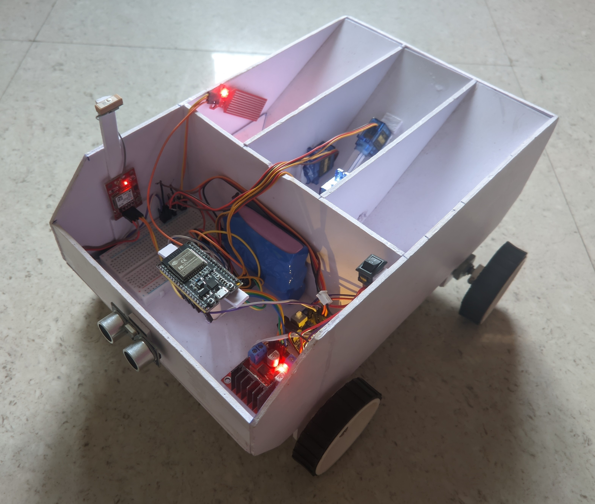
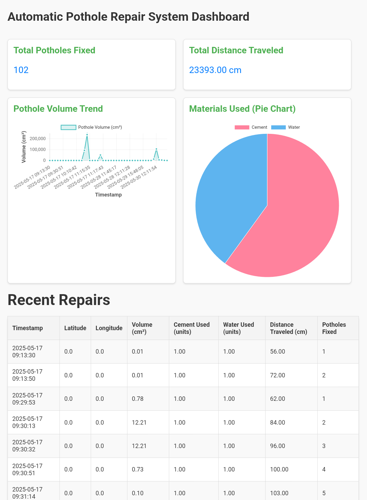
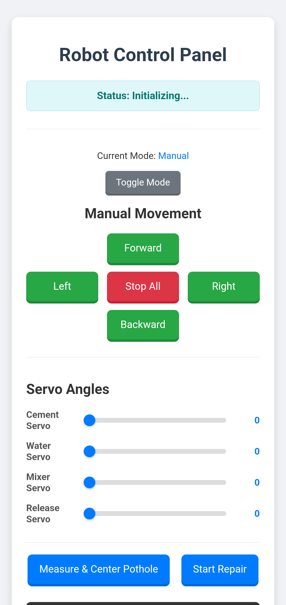

🚧 Automatic Pothole Repair Robot 🤖
This repository contains the firmware for an ESP32-based robot designed to autonomously detect and repair potholes, and report its activities to a centralized web dashboard hosted on PythonAnywhere. The system aims to provide a low-cost, efficient solution for infrastructure maintenance.

✨ Features
Autonomous Navigation: Moves forward and detects obstacles. 🚦

Pothole Detection & Measurement: Utilizes ultrasonic sensors to detect potholes, measure their length, and estimate their volume. 📏

Automated Repair Sequence: 🛠️

Precise positioning over the pothole.🎯

Automated dispensing of cement and water using servos.💧

Material mixing using a DC motor.🌀

Mixture release using a servo.➡️

GPS Tracking: Records the latitude and longitude of repaired potholes. 📍🌍

Cloud Reporting: Sends repair data (location, volume, materials used, cumulative stats) and status updates to a Flask server hosted on PythonAnywhere via HTTPS. ☁️📊

Web-based Manual Control & Monitoring: A built-in web server on the ESP32 allows for: 🌐

Toggling between Autonomous and Manual modes. 🔄

Manual control of robot movement (Forward, Backward, Left, Right, Stop). 🎮

Manual control of dispenser servos (Cement, Water, Release) via sliders. ⚙️

Manual triggering of Pothole Measurement & Centering, and Repair Sequences. 🔧

Real-time log monitoring from the robot. 📝

Multi-threaded HTTP Communication: Uses FreeRTOS tasks and queues for non-blocking HTTP POST requests to the cloud server, ensuring smooth robot operation. ⚡

Debounced Pothole Detection: Implements debouncing for the bottom ultrasonic sensor to prevent false positives from noisy readings. 🛡️

⚙️ Hardware Requirements
ESP32 Development Board: (e.g., ESP32-DevKitC, NodeMCU-32S) 🧠

L298N Motor Driver: For controlling the main movement motors and the mixer DC motor. 🔌

DC Motors (2x or 4x): For robot movement (differential drive assumed). 🚗

DC Motor (1x): For material mixing. 🌪️

SG90/MG90S Servos (3x): 🦾

1x for Cement Dispensing

1x for Water Dispensing

1x for Mixture Release (previously "under motor")

Ultrasonic Sensors (2x HC-SR04): 📡

1x for Front (Obstacle Detection)

1x for Bottom (Pothole Detection)

Neo-6M GPS Module: For location tracking. 🛰️

WiFi Network: (Mobile hotspot or router) to provide internet connectivity. 📶

Power Supply: Separate power supply for motors (e.g., 7-12V battery pack) and appropriate voltage regulators for ESP32 and sensors if needed. 🔋

Pin Assignments (Refer to code for latest)
Main Movement Motors (L298N):

motor1_IN1_MAIN: GPIO 25

motor1_IN2_MAIN: GPIO 26

motor2_IN3_MAIN: GPIO 27

motor2_IN4_MAIN: GPIO 14

Mixer DC Motor (L298N - assumed connected to another set of L298N outputs):

MIXER_MOTOR_IN1: GPIO 17

MIXER_MOTOR_IN2: GPIO 16

Dispenser Servos:

cementServoPin: GPIO 18

waterServoPin: GPIO 5

releaseServoPin (Under/Release Servo): GPIO 4

Ultrasonic Sensors:

trigPinFront: GPIO 23

echoPinFront: GPIO 22

trigPinBottom: GPIO 21

echoPinBottom: GPIO 19

GPS Module:

GPS_RX_PIN: GPIO 32 (Connect to GPS TX)

GPS_TX_PIN: GPIO 33 (Connect to GPS RX, though often only RX is needed on ESP32)

Water Level Sensor:

NOTE: waterLevelPin was originally intended for GPIO 4, but this pin is now used by releaseServoPin. If a water level sensor is critical, it MUST be connected to a different available GPIO pin (e.g., GPIO 34, 35, 36, 39 are typically input-only). The current code effectively bypasses this sensor by always returning true from checkMaterialLevel(). ⚠️

💻 Software Requirements
Arduino IDE: Or PlatformIO. 📝

ESP32 Board Package: Install the ESP32 board definitions in your Arduino IDE. 📥

Libraries (Arduino IDE -> Sketch -> Include Library -> Manage Libraries...): 📚

WiFi (built-in)

WiFiClientSecure (built-in)

HTTPClient (built-in)

TinyGPSPlus by Mikal Hart

ESP32Servo by John Wasser (ensure you use the ESP32-specific version)

ArduinoJson by Benoit Blanchon

WebServer (built-in for ESP32)

FreeRTOS (built-in with ESP32 core)

PythonAnywhere Account: For hosting the Flask web server. ☁️

Flask Web Application: (Refer to your app.py for PythonAnywhere) to receive data and serve the dashboard. This Flask app should use a JSON file for data storage (as per recent updates, not a database). 🐍

🚀 Setup Instructions
1. ESP32 Code Setup
Clone this repository (or copy the main.ino content from your Canvas). 📂

Open in Arduino IDE. IDE

Install required libraries (see Software Requirements above). ✅

Update WiFi Credentials: In main.ino (or your primary .ino file), replace ssid and password with your actual WiFi network details: 🔑

const char* ssid = "YOUR_WIFI_SSID";
const char* password = "YOUR_WIFI_PASSWORD";

Update PythonAnywhere Server Name: Replace ganeshganji.pythonanywhere.com with your actual PythonAnywhere domain: 🌐

const char* serverName = "YOUR_PYTHONANYWHERE_USERNAME.pythonanywhere.com";

Calibrate Servo Angles: The CEMENT_SERVO_CLOSED_ANGLE, CEMENT_SERVO_OPEN_ANGLE, WATER_SERVO_CLOSED_ANGLE, WATER_SERVO_OPEN_ANGLE, RELEASE_SERVO_CLOSED_ANGLE, and RELEASE_SERVO_OPEN_ANGLE are currently set to 3 and 88 degrees respectively. These are example values; you MUST calibrate them for your specific servos and dispenser mechanism to ensure correct opening/closing and dispensing. 📐

Calibrate System Constants: Adjust POTHOLE_THRESHOLD_DISTANCE_CM, OBSTACLE_DETECTION_DISTANCE_CM, and VEHICLE_SPEED_CM_PER_SEC based on your robot's physical characteristics and sensor readings. ⚙️

Review Pin Assignments: Double-check all const int pin definitions against your actual hardware connections. Pay special attention to the pin conflict on GPIO 4 if you intend to use a water level sensor. 📌

Upload: Select your ESP32 board and port in the Arduino IDE, then upload the code. ⬆️

2. PythonAnywhere Flask Server Setup
Log in to PythonAnywhere. 🔑

Web App: Go to the "Web" tab and create a new Flask web app (if you haven't already). Note your domain (e.g., yourusername.pythonanywhere.com).

app.py: Create an app.py file in your Flask app's directory (e.g., /home/yourusername/mysite/app.py or /home/yourusername/APRS/app.py). 📄

Copy the Flask application code (from previous discussions, the version that uses JSON file storage) into this app.py file.

Crucially, update the DATA_FILE path in app.py to an absolute path that exists on your PythonAnywhere account (e.g., /home/yourusername/repair_data.json or /home/yourusername/APRS/repair_data.json). 📂

templates Folder: Create a folder named templates in the same directory as your app.py (e.g., /home/yourusername/APRS/templates/). 📁

dashboard.html: Inside the templates folder, create dashboard.html and paste the HTML content for your dashboard (from previous discussions). Ensure the key names (pothole_volume_cm3, cement_units_used, water_units_used, cumulative_distance_m, cumulative_potholes_fixed) match the JSON data being sent by the ESP32. 📊

Reload Web App: After making changes, go to your PythonAnywhere "Web" tab and click the "Reload" button for your web app. ♻️

Check Server Log: Monitor the "Server log" on PythonAnywhere for any errors during startup or data reception. 📝

🏃 Usage
Power on the ESP32 robot. It will attempt to connect to WiFi and then enter autonomous mode (after a 5-second initial delay). 🟢

Access the Robot's Control Panel: Once the ESP32 connects to WiFi, you can access its built-in web server. Find the ESP32's IP address (printed on Serial Monitor during boot) and navigate to http://<ESP32_IP_ADDRESS>/ in your web browser. 🌐

Control Modes:

Autonomous Mode: The robot will move forward, detect potholes and obstacles, and perform repairs automatically, sending data to your PythonAnywhere server. Logs from the robot will stream to the web interface.  autonomously

Manual Mode: Use the web interface buttons to manually control movement (Forward, Backward, Left, Right, Stop). You can also use the sliders to manually open/close the Cement, Water, and Release servos. Triggering "Measure & Center Pothole" or "Start Repair" will execute those sequences once in manual mode. 🧑‍🤝‍

View Dashboard: Open your PythonAnywhere web app URL (e.g., https://yourusername.pythonanywhere.com/) in your browser to view the dashboard with aggregated repair data, charts, and a log of recent repairs. 📈

🗺️ System Architecture
The system follows a distributed architecture:

Pothole Repair Robot (ESP32): Acts as the edge device, performing real-time sensing, actuation, and local control. It communicates wirelessly with a cloud server. 🤖📡

PythonAnywhere Flask Server: A cloud-hosted web application that acts as a central hub. It receives repair data from the robot, stores it in a JSON file, and serves a user-friendly dashboard. ☁️📊

User Web Browser: The client-side interface for monitoring and manual control, accessing both the robot's local web server (for direct control) and the PythonAnywhere dashboard (for aggregated data). 💻

Data is sent from the robot to PythonAnywhere using HTTPS POST requests. 🔒

🖼️ Images

👋 Contributing
Contributions are welcome! If you find bugs, have feature requests, or want to improve the code, please feel free to open an issue or submit a pull request. 🤝

📜 License
This project is open-source and available under the MIT License. 📄
